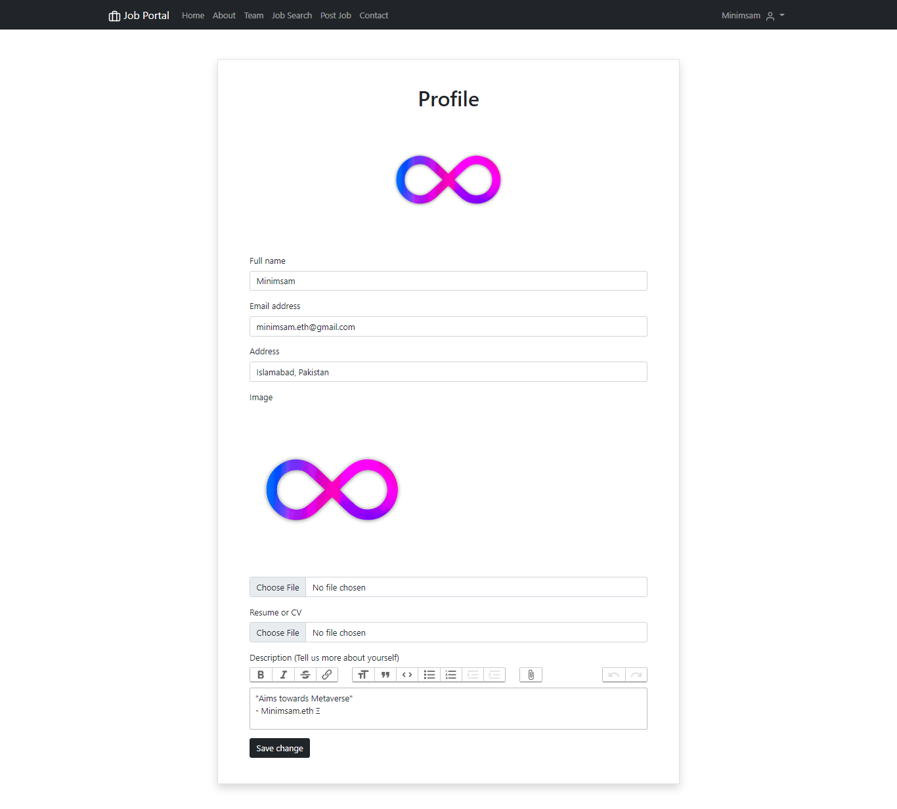
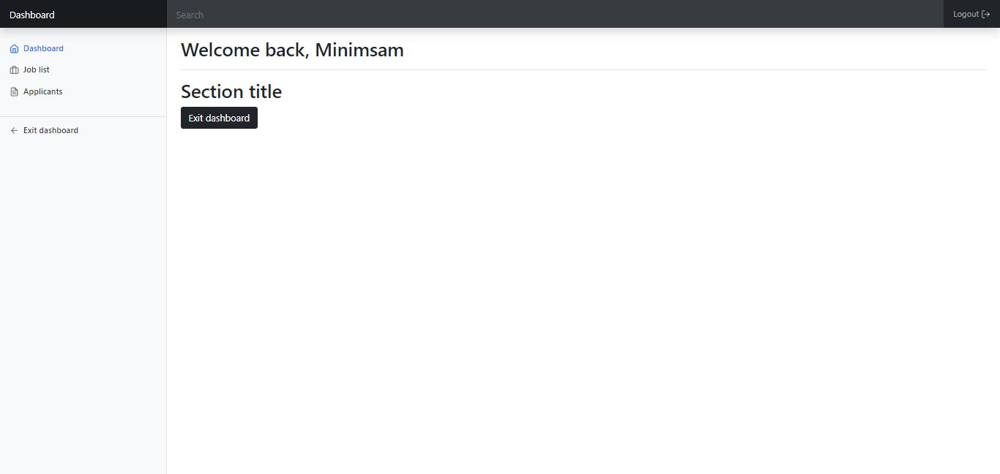
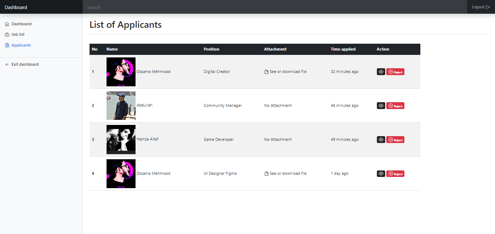
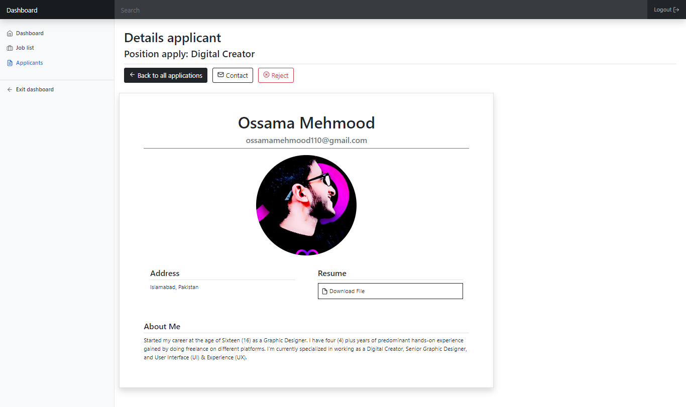

# Job Portal 

Find your dream job here
Various career opportunities await you. Find the right career and connect with companies anytime, anywhere 🎯

<p align="center">
  
</p>

## About Job Portal

Job Portal is the topest job site in the worldwith unique visitors every month. Indeed strives to put job seekers first, giving them free access to search for jobs, post resumes, and research companies. Every day, we connect millions of people to new opportunities

<p align="center">
  
</p>

<p align="center">
  
</p>

## Our Expert Team

Meets talented group with a shared vision of delivering consistently

<p align="center">
  
</p>

## Job Search

64% of job seekers get hired through a referral. Use Job Portal to boost your chances of getting hired through people you know.

- Search a Job
- View a Jobs
- Apply

<p align="center">
  
</p>

## Login Functionalities
- You can Logiin directly as per your account status `JobSeeeker` or `Company`
- `Forget Password`

<p align="center">
  
</p>

## Register Functionalities

Welcome to JobPortal!
First of all, what do you want to do?
<p align="center">
  
</p>

### Looking for a job
- Show your abilities and qualities as a talent in an easy way. So that recruiters can see if you can be one of the candidates for a job interview.
- `Register as Seeker`

<p align="center">
  
</p>

### Looking for a candidate
- Recruiting candidates is indeed a challenge. We therefore understand that a job recruiter can require multiple job recruitment platforms.
- `Register as Company`

<p align="center">
  
</p>

## Job Seekers & Company
Find and get better job opportunities according to skills and location and Post Opportunities to hire the Professionals
<p align="center">
  
</p>

### Job Seekers
Find and get better job opportunities according to skills and location.
- Applicant on Job
- Search Jobs as candidate
- Update his/her profile
- Upload Resume

<p align="center">
  
</p>

<p align="center">
  
</p>

<p align="center">
  
</p>

### Company
Post job advertisements to connect with the most potential job seekers.
- View applicant on Jobs
- Post Job as company
- Edit Job Requirements or Cancel
- Accept/Reject Candidate

<p align="center">
  
</p>


## Dashboard
Welcome back,
<p align="center">
  
</p>

- Job Lists
- Applicants
- Applicants Profile
- Exit Dashboard

<p align="center">
  
</p>
<p align="center">
  
</p>
<p align="center">
  
</p>

## User credentials

#### Job Seekers

- Ossama Mehmood <br>
Email: `ossamamehmood110@gmail.com`
Password: `ossamamehmood`

- Hamza Altaf <br>
Email: `hamzaaltaf481@gmail.com`
Password: `hamzaaltaf`

- Abdullah <br>
Email: `razzaqabdullah7867@@gmail.com`
Password: `razzaqabdullah`

### Company

- Minimsam <br>
Email: `minimsam.eth@gmail.com`
Password: `minimsam`

<br>
<p align="center">
  
</p>


## Install the following Xampp, Visual Studio Code and Composer:
- Download <a href="https://www.apachefriends.org/download.html" target="_blank">Xampp</a>
- Download <a href="https://code.visualstudio.com/download" target="_blank">VS Code</a>
- Download <a href="https://getcomposer.org/download" target="_blank">Composer</a>

## Run Job Portal (Build in Laravel)
- Open Xampp to start `Apache` and `MySQL`
- Create a database locally `http://localhost/phpmyadmin` named `JobPortal`
- Import the database `SQL` file given in `JobPortal/Database` into `JobPortal`
- Rename `.env.example` file to `.env`inside your project root and fill the database information.
  (windows wont let you do it, so you have to open your console cd your project root directory and run `mv .env.example .env` )
- Open the project folder in `Visual Studio Code` and `Open Terminal`
- Run `composer install` , ```php composer.phar install``` , `composer update` , `composer install --ignore-platform-reqs`
- Run `php artisan key:generate` 
- Run `php artisan migrate`
- Run `php artisan db:seed` to run seeders, if any.
- Run `php artisan serve`
- Follow `Link` <a href="http://127.0.0.1:8000" target="_blank">127.0.0.1:8000</a>
<p align="center">
  
</p>

## Some reason project stop working :
- `composer update`
- `php artisan migrate`

## Support 💓

Support at <a href="https://www.patreon.com/ossamamehmood" target="_blank">Patreon</a>

<tr><td align="center"><a href="https://github.com/ossamamehmood"><kbd></kbd><br /><sub><b>Ossama Mehmood</b></sub></a><br /></td>

</tr>
